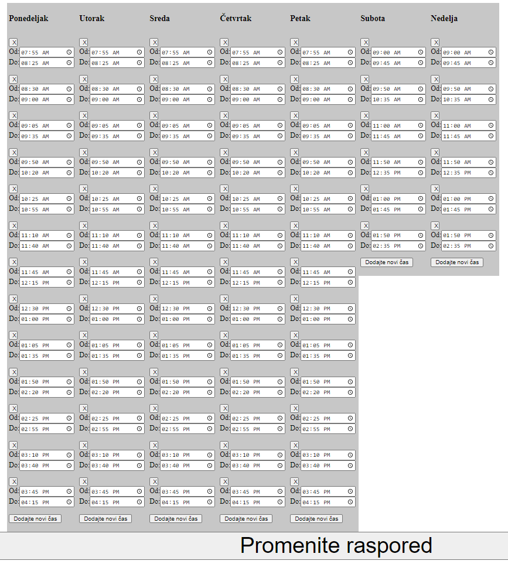

# Korisničko upustvo

## Pristupanje sajtu za kontrolu

1. Povezati se na WIFI mrežu Zvono u prizemlju škole
2. Ući na pretraživač na mobilnom telefonu (Google)
3. Ukucati adresu 192.168.1.99:5000

Ukoliko vidite prikaz na slici ušli ste na sajt zvona

## Paljenje i gašenje zvona

Pritiskom na tekst **Upalite zvono** zvono c1e ponovo pocheti da radi. Ovo je potreno uraditi u sluchaju da ne stane struje ili se zvono namerno isključi iz struje.

U slučaju da je zvono upaljeno umesto **Upalite zvono** pisaće **Ugasite zvono** i pritiskom na taj tekst moguće je ugasiti zvono

## Kontrola vremena zvonjenja 

Kontrola zvona se može izvršiti pritiskom na tekst **Promenite raspored**. Pojaviće se strana 

### Dodavanje časa

Dodavanje časa može se izvršiti pritiskom na dugme **Dodaj novi čas** ispod odgovarajućeg dana. Nakon pritiska pojaviće se dva nova polja za izbor početka i kraja novog časa

### Brisanje i promena vremena zvonjenja časa

Čas je moguće obrisati pritiskom na dugme [X] iznad odgovarajućeg časa.

Promenu vremena možemo izvršiti pritiskom na polje koje želimo da proverimo

### Čuvanje promena
Pritiskom na dugme **Promenite raspored** napravljenje promene će se sačuvati.